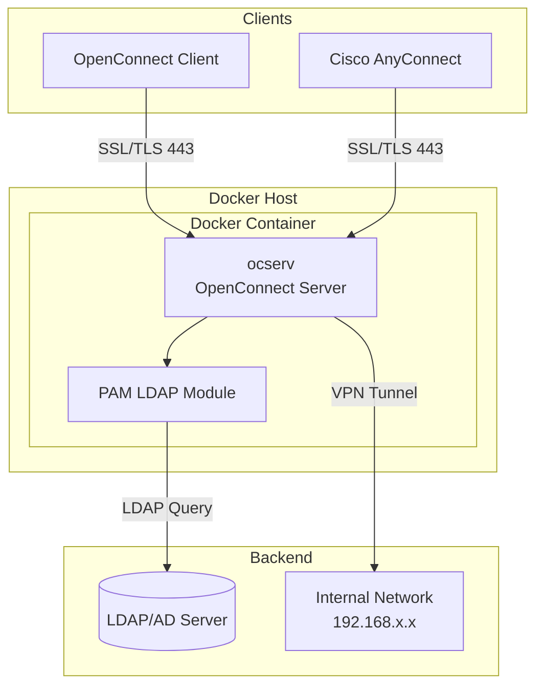

# OpenConnect VPN Server with LDAP/AD Authentication

[](https://hub.docker.com/r/cdryzun/docker-openconnect-ldap)
[](https://hub.docker.com/r/cdryzun/docker-openconnect-ldap)
[](https://github.com/cdryzun/docker-openconnect-ldap)
[](LICENSE)
[](https://github.com/cdryzun/docker-openconnect-ldap/actions)

[English](README.md) | [中文](README_CN.md)

A Docker container for OpenConnect VPN server with LDAP/Active Directory authentication support. Secure, lightweight, and easy to deploy.

## Table of Contents

- [Features](#features)
- [Architecture](#architecture)
- [Quick Start](#quick-start)
  - [Docker Compose](#docker-compose)
  - [Kubernetes](#kubernetes)
- [Configuration](#configuration)
  - [Environment Variables](#environment-variables)
  - [Volumes](#volumes)
  - [Ports](#ports)
- [Certificates](#certificates)
- [Advanced Configuration](#advanced-configuration)
- [Security Best Practices](#security-best-practices)
- [Troubleshooting](#troubleshooting)
- [FAQ](#faq)
- [Contributing](#contributing)
- [License](#license)

## Features

- **Base Image**: Debian Latest
- **OpenConnect Server**: Latest stable version
- **LDAP/AD Authentication**: Built-in libpam-ldap support
- **Multi-Platform**: Supports `linux/amd64` and `linux/arm64`
- **Flexible Networking**:
  - Customizable DNS servers
  - Split tunneling support
  - Full tunnel mode
- **Auto Certificate Generation**: Creates self-signed certs or use your own
- **Persistent Configuration**: Mount config directory for persistence
- **AnyConnect Compatible**: Works with Cisco AnyConnect clients

## Architecture



## Quick Start

### Docker Compose

1. Create a `docker-compose.yaml` file:

```yaml
version: "3"

services:
  ocserv:
    container_name: ocserv
    image: cdryzun/docker-openconnect-ldap:latest
    ports:
      - "443:443/tcp"
      - "443:443/udp"
    environment:
      LISTEN_PORT: 443
      TUNNEL_MODE: 'split-include'
      TUNNEL_ROUTES: '192.168.1.0/24, 192.168.69.0/24'
      DNS_SERVERS: 192.168.1.1
      SPLIT_DNS_DOMAINS: 'internal.domain.com'
      CLIENTNET: 192.168.248.0
      CLIENTNETMASK: 255.255.255.128
      BASEDN: 'dc=example,dc=com'
      LDAPURI: 'ldap://192.168.1.1/'
      BINDDN: 'CN=ocserv,CN=Users,DC=example,DC=com'
      BINDPW: 'YourSecurePassword'
      SEARCHSCOPE: 'sub'
      PAM_LOGIN_ATTRIBUTE: 'userPrincipalName'
      CA_CN: 'VPN CA'
      CA_ORG: 'OCSERV'
      CA_DAYS: 9999
      SRV_CN: 'vpn.example.com'
      SRV_ORG: 'Example Company'
      SRV_DAYS: 9999
    volumes:
      - './config/:/config/'
    cap_add:
      - NET_ADMIN
    privileged: true
    restart: unless-stopped
```

2. Start the service:

```bash
docker-compose up -d
```

### Kubernetes

```bash
cd example/kubernetes
kubectl apply -f .
```

> **Note**: The example uses LocalPV. Create the local PV directory before deployment.

## Configuration

### Environment Variables

| Variable | Required | Description | Default | Example |
|----------|----------|-------------|---------|---------|
| `LISTEN_PORT` | No | VPN listening port | `443` | `443` |
| `DNS_SERVERS` | No | DNS servers (comma-separated) | - | `8.8.8.8,8.8.4.4` |
| `TUNNEL_MODE` | No | Tunnel mode | `all` | `split-include` |
| `TUNNEL_ROUTES` | No | Routes for split tunnel (CIDR) | - | `192.168.1.0/24` |
| `SPLIT_DNS_DOMAINS` | No | DNS domains for split DNS | - | `example.com` |
| `CLIENTNET` | No | Client IP network | `192.168.255.0` | `192.168.248.0` |
| `CLIENTNETMASK` | No | Client subnet mask | `255.255.255.0` | `255.255.255.128` |
| `BASEDN` | **Yes** | LDAP Base DN | - | `dc=example,dc=com` |
| `LDAPURI` | **Yes** | LDAP Server URI | - | `ldap://192.168.1.1` |
| `BINDDN` | **Yes** | LDAP Bind DN | - | `CN=ocserv,CN=Users,DC=example,DC=com` |
| `BINDPW` | **Yes** | LDAP Bind Password | - | `YourPassword` |
| `SEARCHSCOPE` | No | LDAP search scope | `sub` | `sub` / `one` / `base` |
| `PAM_LOGIN_ATTRIBUTE` | No | LDAP login attribute | `userPrincipalName` | `sAMAccountName` / `uid` |
| `CA_CN` | No | CA Common Name | `VPN CA` | `My VPN CA` |
| `CA_ORG` | No | CA Organization | `OCSERV` | `My Company` |
| `CA_DAYS` | No | CA validity days | `9999` | `3650` |
| `SRV_CN` | No | Server Common Name | - | `vpn.example.com` |
| `SRV_ORG` | No | Server Organization | - | `My Company` |
| `SRV_DAYS` | No | Server cert validity | `9999` | `365` |

### Volumes

| Volume | Required | Description |
|--------|----------|-------------|
| `/config` | No | Persistent configuration directory |

### Ports

| Port | Protocol | Description |
|------|----------|-------------|
| `443` | TCP | OpenConnect server (HTTPS) |
| `443` | UDP | OpenConnect server (DTLS) |

## Certificates

### Auto-Generated Certificates

On first start, the container checks for:
- `/config/server-key.pem`
- `/config/server-cert.pem`

If not found, self-signed certificates are automatically generated using the `CA_*` and `SRV_*` environment variables.

### Using Your Own Certificates

Place your certificates at:
```
/config/server-key.pem
/config/server-cert.pem
```

For Let's Encrypt or other CA-signed certificates, ensure the full chain is included in `server-cert.pem`.

## Advanced Configuration

All configuration files are located in the `/config` volume:

- `ocserv.conf` - Main server configuration
- `pam_ldap.conf` - LDAP authentication settings

Advanced features available:
- Site-to-site VPN
- User groups and access control
- Proxy Protocol support
- Custom routing rules

## Security Best Practices

1. **Use Strong LDAP Bind Passwords**: Never use default or weak passwords
2. **Enable LDAPS**: Use `ldaps://` instead of `ldap://` when possible
3. **Restrict Network Access**: Use firewall rules to limit access to the VPN port
4. **Use Proper Certificates**: Replace self-signed certs with CA-signed certificates in production
5. **Regular Updates**: Keep the container image updated
6. **Secrets Management**: Use Docker secrets or Kubernetes secrets for sensitive data
7. **Audit Logging**: Monitor VPN connection logs for suspicious activity

## Troubleshooting

### Connection Issues

**Problem**: Client cannot connect to VPN

**Solutions**:
1. Check if port 443 is accessible: `nc -zv your-server 443`
2. Verify container is running: `docker ps`
3. Check container logs: `docker logs ocserv`

### Authentication Failures

**Problem**: LDAP authentication fails

**Solutions**:
1. Verify LDAP URI is correct and reachable
2. Test LDAP bind credentials manually
3. Check `PAM_LOGIN_ATTRIBUTE` matches your LDAP schema
4. Review logs: `docker logs ocserv | grep -i ldap`

### Certificate Errors

**Problem**: Client shows certificate warning

**Solutions**:
1. Use CA-signed certificates for production
2. Import the CA certificate to client devices
3. Ensure `SRV_CN` matches your VPN hostname

### Log Messages

**Login success**:
```
[info] User bob Connected - Server: 192.168.1.165 VPN IP: 192.168.255.194 Remote IP: 107.92.120.188
```

**Logout**:
```
[info] User bob Disconnected - Bytes In: 175856 Bytes Out: 4746819 Duration:63
```

## FAQ

**Q: Which clients are supported?**

A: OpenConnect client (all platforms) and Cisco AnyConnect client (tested with version 4.802045+).

**Q: Can I use this without LDAP?**

A: This image is specifically designed for LDAP authentication. For local user authentication, consider the base ocserv image.

**Q: How do I enable split tunneling?**

A: Set `TUNNEL_MODE=split-include` and define routes in `TUNNEL_ROUTES`.

**Q: Is IPv6 supported?**

A: Currently, the container primarily supports IPv4. IPv6 support may be added in future versions.

**Q: How do I update the container?**

A:
```bash
docker-compose pull
docker-compose up -d
```

## Contributing

Contributions are welcome! Please read our [Contributing Guide](CONTRIBUTING.md) before submitting a Pull Request.

## License

This project is open source. See the [LICENSE](LICENSE) file for details.

## Links

- [OpenConnect Homepage](https://ocserv.gitlab.io/www/platforms.html)
- [OpenConnect Documentation](https://ocserv.gitlab.io/www/manual.html)
- [OpenConnect Source Code](https://gitlab.com/ocserv/ocserv)
- [Report Issues](https://github.com/cdryzun/docker-openconnect-ldap/issues)
