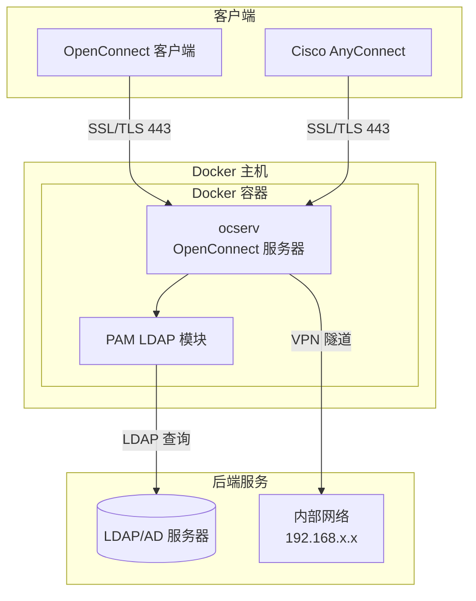

# OpenConnect VPN 服务器 - 支持 LDAP/AD 认证

[](https://hub.docker.com/r/cdryzun/docker-openconnect-ldap)
[](https://hub.docker.com/r/cdryzun/docker-openconnect-ldap)
[](https://github.com/cdryzun/docker-openconnect-ldap)
[](LICENSE)
[](https://github.com/cdryzun/docker-openconnect-ldap/actions)

[English](README.md) | [中文](README_CN.md)

基于 Docker 的 OpenConnect VPN 服务器，支持 LDAP/Active Directory 认证。安全、轻量、易于部署。

## 目录

- [功能特性](#功能特性)
- [架构图](#架构图)
- [快速开始](#快速开始)
  - [Docker Compose](#docker-compose)
  - [Kubernetes](#kubernetes)
- [配置说明](#配置说明)
  - [环境变量](#环境变量)
  - [数据卷](#数据卷)
  - [端口](#端口)
- [证书配置](#证书配置)
- [高级配置](#高级配置)
- [安全最佳实践](#安全最佳实践)
- [故障排除](#故障排除)
- [常见问题](#常见问题)
- [贡献指南](#贡献指南)
- [许可证](#许可证)

## 功能特性

- **基础镜像**: Debian 最新版
- **OpenConnect 服务器**: 最新稳定版本
- **LDAP/AD 认证**: 内置 libpam-ldap 支持
- **多平台支持**: 支持 `linux/amd64` 和 `linux/arm64`
- **灵活的网络配置**:
  - 自定义 DNS 服务器
  - 分流隧道支持
  - 全流量隧道模式
- **自动证书生成**: 自动创建自签名证书或使用自有证书
- **持久化配置**: 挂载配置目录实现持久化
- **AnyConnect 兼容**: 支持 Cisco AnyConnect 客户端

## 架构图



## 快速开始

### Docker Compose

1. 创建 `docker-compose.yaml` 文件：

```yaml
version: "3"

services:
  ocserv:
    container_name: ocserv
    image: cdryzun/docker-openconnect-ldap:latest
    ports:
      - "443:443/tcp"
      - "443:443/udp"
    environment:
      LISTEN_PORT: 443
      TUNNEL_MODE: 'split-include'
      TUNNEL_ROUTES: '192.168.1.0/24, 192.168.69.0/24'
      DNS_SERVERS: 192.168.1.1
      SPLIT_DNS_DOMAINS: 'internal.domain.com'
      CLIENTNET: 192.168.248.0
      CLIENTNETMASK: 255.255.255.128
      BASEDN: 'dc=example,dc=com'
      LDAPURI: 'ldap://192.168.1.1/'
      BINDDN: 'CN=ocserv,CN=Users,DC=example,DC=com'
      BINDPW: '你的安全密码'
      SEARCHSCOPE: 'sub'
      PAM_LOGIN_ATTRIBUTE: 'userPrincipalName'
      CA_CN: 'VPN CA'
      CA_ORG: 'OCSERV'
      CA_DAYS: 9999
      SRV_CN: 'vpn.example.com'
      SRV_ORG: 'Example Company'
      SRV_DAYS: 9999
    volumes:
      - './config/:/config/'
    cap_add:
      - NET_ADMIN
    privileged: true
    restart: unless-stopped
```

2. 启动服务：

```bash
docker-compose up -d
```

### Kubernetes

```bash
cd example/kubernetes
kubectl apply -f .
```

> **注意**: 示例使用 LocalPV，部署前需要创建本地 PV 目录。

## 配置说明

### 环境变量

| 变量 | 必需 | 描述 | 默认值 | 示例 |
|------|------|------|--------|------|
| `LISTEN_PORT` | 否 | VPN 监听端口 | `443` | `443` |
| `DNS_SERVERS` | 否 | DNS 服务器（逗号分隔） | - | `8.8.8.8,8.8.4.4` |
| `TUNNEL_MODE` | 否 | 隧道模式 | `all` | `split-include` |
| `TUNNEL_ROUTES` | 否 | 分流隧道路由（CIDR） | - | `192.168.1.0/24` |
| `SPLIT_DNS_DOMAINS` | 否 | 分流 DNS 域名 | - | `example.com` |
| `CLIENTNET` | 否 | 客户端 IP 网段 | `192.168.255.0` | `192.168.248.0` |
| `CLIENTNETMASK` | 否 | 客户端子网掩码 | `255.255.255.0` | `255.255.255.128` |
| `BASEDN` | **是** | LDAP Base DN | - | `dc=example,dc=com` |
| `LDAPURI` | **是** | LDAP 服务器 URI | - | `ldap://192.168.1.1` |
| `BINDDN` | **是** | LDAP 绑定 DN | - | `CN=ocserv,CN=Users,DC=example,DC=com` |
| `BINDPW` | **是** | LDAP 绑定密码 | - | `你的密码` |
| `SEARCHSCOPE` | 否 | LDAP 搜索范围 | `sub` | `sub` / `one` / `base` |
| `PAM_LOGIN_ATTRIBUTE` | 否 | LDAP 登录属性 | `userPrincipalName` | `sAMAccountName` / `uid` |
| `CA_CN` | 否 | CA 通用名称 | `VPN CA` | `My VPN CA` |
| `CA_ORG` | 否 | CA 组织名称 | `OCSERV` | `我的公司` |
| `CA_DAYS` | 否 | CA 有效期（天） | `9999` | `3650` |
| `SRV_CN` | 否 | 服务器通用名称 | - | `vpn.example.com` |
| `SRV_ORG` | 否 | 服务器组织名称 | - | `我的公司` |
| `SRV_DAYS` | 否 | 服务器证书有效期 | `9999` | `365` |

### 数据卷

| 数据卷 | 必需 | 描述 |
|--------|------|------|
| `/config` | 否 | 持久化配置目录 |

### 端口

| 端口 | 协议 | 描述 |
|------|------|------|
| `443` | TCP | OpenConnect 服务器 (HTTPS) |
| `443` | UDP | OpenConnect 服务器 (DTLS) |

## 证书配置

### 自动生成证书

首次启动时，容器会检查以下文件：
- `/config/server-key.pem`
- `/config/server-cert.pem`

如果文件不存在，将使用 `CA_*` 和 `SRV_*` 环境变量自动生成自签名证书。

### 使用自有证书

将证书放置在以下位置：
```
/config/server-key.pem
/config/server-cert.pem
```

如果使用 Let's Encrypt 或其他 CA 签名的证书，请确保 `server-cert.pem` 包含完整的证书链。

## 高级配置

所有配置文件位于 `/config` 数据卷中：

- `ocserv.conf` - 主服务器配置
- `pam_ldap.conf` - LDAP 认证设置

可用的高级功能：
- 站点到站点 VPN
- 用户组和访问控制
- 代理协议支持
- 自定义路由规则

## 安全最佳实践

1. **使用强密码**: LDAP 绑定密码不要使用默认或弱密码
2. **启用 LDAPS**: 尽可能使用 `ldaps://` 替代 `ldap://`
3. **限制网络访问**: 使用防火墙规则限制 VPN 端口的访问
4. **使用正规证书**: 生产环境中使用 CA 签名的证书替代自签名证书
5. **定期更新**: 保持容器镜像更新
6. **密钥管理**: 使用 Docker secrets 或 Kubernetes secrets 管理敏感数据
7. **审计日志**: 监控 VPN 连接日志以发现可疑活动

## 故障排除

### 连接问题

**问题**: 客户端无法连接到 VPN

**解决方案**:
1. 检查端口 443 是否可访问: `nc -zv your-server 443`
2. 验证容器是否运行: `docker ps`
3. 查看容器日志: `docker logs ocserv`

### 认证失败

**问题**: LDAP 认证失败

**解决方案**:
1. 验证 LDAP URI 是否正确且可达
2. 手动测试 LDAP 绑定凭据
3. 检查 `PAM_LOGIN_ATTRIBUTE` 是否与 LDAP 架构匹配
4. 查看日志: `docker logs ocserv | grep -i ldap`

### 证书错误

**问题**: 客户端显示证书警告

**解决方案**:
1. 生产环境使用 CA 签名的证书
2. 将 CA 证书导入客户端设备
3. 确保 `SRV_CN` 与 VPN 主机名匹配

### 日志消息

**登录成功**:
```
[info] User bob Connected - Server: 192.168.1.165 VPN IP: 192.168.255.194 Remote IP: 107.92.120.188
```

**登出**:
```
[info] User bob Disconnected - Bytes In: 175856 Bytes Out: 4746819 Duration:63
```

## 常见问题

**问: 支持哪些客户端？**

答: OpenConnect 客户端（所有平台）和 Cisco AnyConnect 客户端（已测试 4.802045+ 版本）。

**问: 可以不使用 LDAP 吗？**

答: 此镜像专为 LDAP 认证设计。如需本地用户认证，请考虑使用基础 ocserv 镜像。

**问: 如何启用分流隧道？**

答: 设置 `TUNNEL_MODE=split-include` 并在 `TUNNEL_ROUTES` 中定义路由。

**问: 支持 IPv6 吗？**

答: 目前容器主要支持 IPv4。IPv6 支持可能在未来版本中添加。

**问: 如何更新容器？**

答:
```bash
docker-compose pull
docker-compose up -d
```

## 贡献指南

欢迎贡献！提交 Pull Request 前请阅读我们的[贡献指南](CONTRIBUTING.md)。

## 许可证

本项目为开源项目。详情请查看 [LICENSE](LICENSE) 文件。

## 相关链接

- [OpenConnect 官网](https://ocserv.gitlab.io/www/platforms.html)
- [OpenConnect 文档](https://ocserv.gitlab.io/www/manual.html)
- [OpenConnect 源码](https://gitlab.com/ocserv/ocserv)
- [问题反馈](https://github.com/cdryzun/docker-openconnect-ldap/issues)
